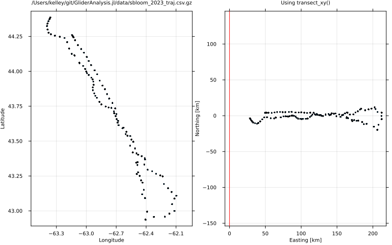

# Examples

## Transect lon-lat to x-y calculation



```julia
using GliderAnalysis, Plots, DataFrames, CSV

file = joinpath(dirname(dirname(pathof(GliderAnalysis))), "data", "sbloom_2023_traj.csv.gz")
traj = CSV.read(file, DataFrame);

xy = transect_xy(traj.longitude, traj.latitude)
ll = transect_xy(xy[:, 1], xy[:, 2]; inverse=true)

fs = 7
KW = (framestyle=:box, tickdirection=:out, label=false, ms=1, guidefontsize=fs, tickfontsize=fs, titlefontsize=fs)
a = Plots.scatter(traj.longitude, traj.latitude, aspect_ratio=1.4, xlab="Longitude", ylab="Latitude", title=file; KW...)
b = Plots.scatter(xy[:, 1], xy[:, 2], aspect_ratio=1.0, xlab="Easting [km]", ylab="Northing [km]", title="Using transect_xy()"; KW...)
Plots.vline!([0], lwd=3, color=:red, label=false)
Plots.plot(a, b, layout=(1, 2), size=(800, 500))

savefig("transect_xy.png")
```


